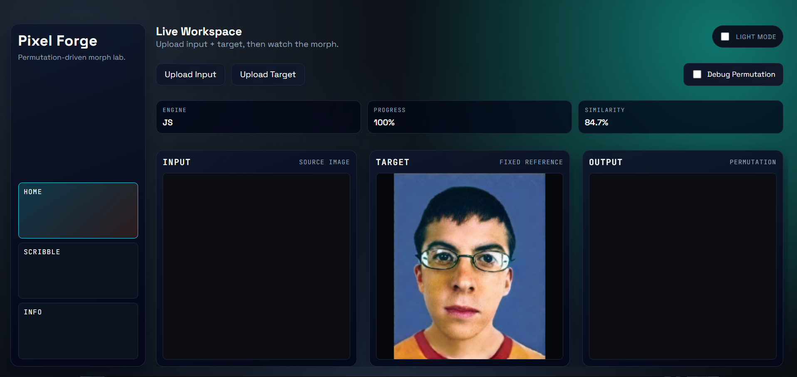

# Pixel Forge 

  

> **"What if you could take the chaos of one image and reorder it into the order of another?"**

**Pixel Forge** is a pure-math visualization experiment that rearranges pixels from a source image to match a target silhouette using deterministic brightness sorting. No AI. No neural networks. No blending. Just raw pixel manipulation.



---

## � Table of Contents

- [Concept](#-concept)
- [Features](#-features)
- [How It Works](#-how-it-works)
- [Technical Deep Dive](#-technical-deep-dive)
- [Installation](#-installation)
- [Usage](#-usage)
- [Project Structure](#-project-structure)
- [Contributing](#-contributing)
- [License](#-license)

---

## 🚀 Concept

Modern image generation relies heavily on generative AI and diffusion models. **Pixel Forge** takes a step back to explore the beauty of simple algorithmic constraints.

The core rule is strict: **Conservation of Pixels**.
- You cannot add new colors.
- You cannot delete existing pixels.
- You can only *move* them.

The result is a "mosaic" effect where the texture of the source image (e.g., a photo of a forest) is forced to conform to the structure of the target image (e.g., a portrait of a person).

---

## 🛠️ Features

### 🎨 Dual Workspaces
- **Home**: Upload any two images (Input + Target) and watch the engine solve the mapping in real-time.
- **Scribble Mode**: A creative playground where you draw the input yourself! Watch your strokes instantly fly across the canvas to form the target image.

### ⚡ Performance Engine
- **WebAssembly (WASM) Core**: Critical path calculations (pixel sorting and mapping) are written in C++ and compiled to WASM for near-native performance.
- **JavaScript Fallback**: If WASM fails to load, a robust JS implementation takes over seamlessly.

### 🎛️ User Controls
- **Live Morph**: A linear interpolation slider allows you to scrub through the transformation.
- **Theme Support**: Fully responsive Dark and Light modes.
- **Debug Mode**: Visualizes the permutation mapping with rainbow colors to prove that pixels are distinct.

---

## ⚙️ How It Works

The algorithm is elegant in its simplicity:

1.  **Luminance Extraction**: Calculate the perceived brightness of every pixel in both the Source $(S)$ and Target $(T)$ images using the standard formula:
    $$L = 0.2126R + 0.7152G + 0.0722B$$

2.  **Sorting**: Create two lists of pixels, one for $S$ and one for $T$, sorted by their luminance values $L$.
    -   $S_{sorted} = [s_1, s_2, ..., s_n]$ where $L(s_1) \le L(s_2) \le ...$
    -   $T_{sorted} = [t_1, t_2, ..., t_n]$ where $L(t_1) \le L(t_2) \le ...$

3.  **Mapping**: The pixel at rank $k$ in the sorted source list is mapped to the position of the pixel at rank $k$ in the sorted target list.
    -   $Map(s_k) \rightarrow Position(t_k)$

4.  **Animation**: Pixels travel from their original coordinates to their mapped coordinates using linear interpolation over time.

---

## 💻 Technical Deep Dive

### Why Brightness Sorting?
Sorting by brightness preserves the *structure* of an image because human vision relies heavily on contrast to define shapes. By matching the darkest pixels of the source to the darkest parts of the target, we reconstruct the target's "shadows" using the source's "dark" pixels (regardless of their actual color).

### The "Mosaic" Effect
Since we don't change colors, the output image will look like the target *structurally*, but will have the *color palette* and *texture* of the source. This is what gives Pixel Forge its unique aesthetic.

---

## 📦 Installation

To run Pixel Forge locally, follow these steps:

### Prerequisites
-   A modern web browser (Chrome, Firefox, Edge, Safari).
-   [Python 3](https://www.python.org/) (recommended for a simple local server) OR [Node.js](https://nodejs.org/).

### Steps

1.  **Clone the Repository**
    ```bash
    git clone https://github.com/armash66/pixel-morph.git
    cd pixel-morph
    ```

2.  **Start a Local Server**
    Because this project uses ES Modules and WebAssembly, you cannot simply open `index.html` file directly from your file explorer. You must serve it over HTTP.

    **Using Python:**
    ```bash
    python -m http.server 8080
    ```

    **Using Node (http-server):**
    ```bash
    npx http-server . -p 8080
    ```

3.  **Launch**
    Open your browser and navigate to:
    `http://localhost:8080`

---

## 📂 Project Structure

```text
pixel-morph/
├── public/                 # Publicly accessible assets
│   ├── css/                # Stylesheets
│   ├── js/                 # Application logic
│   │   ├── app.js          # Home view logic
│   │   ├── scribble.js     # Scribble view logic
│   │   └── main.js         # Router & Theme logic
│   ├── wasm/               # Compiled WASM modules
│   └── assets/             # Default images
├── wasm/                   # C++ Source code for WASM
│   ├── morph.cpp           # Core algorithm
│   └── build.sh            # Build script
├── index.html              # Entry point
└── README.md               # Documentation
```

---

## 🤝 Contributing

Contributions are welcome! If you have ideas for new sorting algorithms (e.g., sorting by Hue or Saturation) or performance improvements:

1.  Fork the Project
2.  Create your Feature Branch (`git checkout -b feature/AmazingFeature`)
3.  Commit your Changes (`git commit -m 'Add some AmazingFeature'`)
4.  Push to the Branch (`git push origin feature/AmazingFeature`)
5.  Open a Pull Request

---

## 📄 License

Distributed under the MIT License. See `LICENSE` for more information.

---

### Built with ❤️ by [Armash](https://github.com/armash66)
